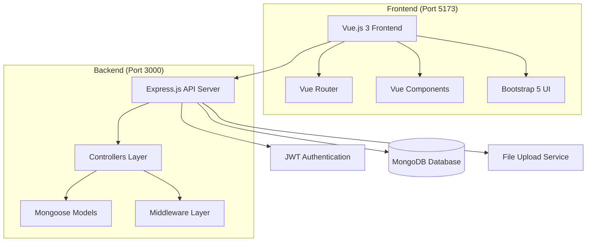
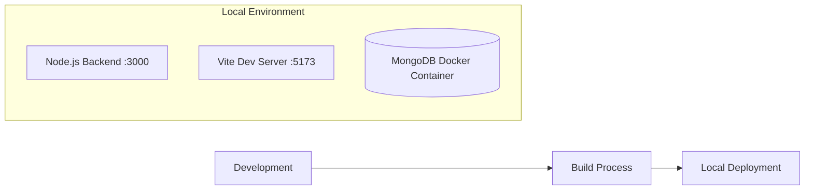

# Design Document

## Overview

Thiết kế hệ thống chuyển đổi từ PHP sang Node.js/Express/MongoDB cho ứng dụng quản lý mượn sách. Hệ thống sẽ sử dụng kiến trúc MVC với RESTful API, tận dụng cấu trúc code đã có trong `default/` làm foundation.

## Architecture

### High-Level Architecture



### Technology Stack

**Backend:**
- Node.js với ES6 modules
- Express.js framework
- MongoDB với Mongoose ODM
- JWT cho authentication
- bcrypt cho password hashing
- CORS cho cross-origin requests

**Frontend:**
- Vue.js 3 với Composition API
- Vue Router 4
- Bootstrap 5
- Axios cho HTTP requests
- Vite build tool

## Components and Interfaces

### Backend Components

#### 1. Models (Mongoose Schemas)

**DocGia Model:**
```javascript
{
  MaDocGia: String (unique, required),
  HoLot: String (required),
  Ten: String (required), 
  NgaySinh: Date (required),
  Phai: String (enum: ['Nam', 'Nữ'], required),
  DiaChi: String (required),
  DienThoai: String (required)
}
```

**Sach Model:**
```javascript
{
  MaSach: String (unique, required),
  TenSach: String (required),
  DonGia: Number (required),
  SoQuyen: Number (required),
  NamXuatBan: Number (required),
  MaNXB: ObjectId (ref: 'NhaXuatBan'),
  NguonGoc: String, // Tác giả hoặc nguồn gốc
}
```

**NhaXuatBan Model:**
```javascript
{
  MaNXB: String (unique, required),
  TenNXB: String (required),
  DiaChi: String (required)
}
```

**TheoDoiMuonSach Model:**
```javascript
{
  MaDocGia: ObjectId (ref: 'DocGia'),
  MaSach: ObjectId (ref: 'Sach'),
  NgayMuon: Date (required),
  NgayTra: Date (nullable),
  TrangThai: String (enum: ['muon', 'tra'], default: 'muon')
}
```

**NhanVien Model:**
```javascript
{
  MSNV: String (unique, required),
  HoTenNV: String (required),
  Password: String (required, hashed),
  ChucVu: String (required),
  DiaChi: String (required),
  SoDienThoai: String (required)
}
```

#### 2. Controllers

Mỗi controller sẽ có các methods chuẩn:
- `getAll(req, res)` - GET với pagination và search
- `getById(req, res)` - GET by ID
- `create(req, res)` - POST tạo mới
- `update(req, res)` - PUT cập nhật
- `remove(req, res)` - DELETE xóa

**Controller Pattern:**
```javascript
export default {
  async getAll(req, res) {
    // Pagination & search logic
    const page = parseInt(req.query.page) || 1;
    const limit = parseInt(req.query.limit) || 10;
    const search = req.query.search || '';
    // Implementation...
  }
  // Other CRUD methods...
}
```

#### 3. Routes Structure

```
/api
├── /auth
│   ├── POST /login
│   ├── POST /logout
│   └── GET /profile
├── /docgia
│   ├── GET / (with pagination & search)
│   ├── GET /:id
│   ├── POST /
│   ├── PUT /:id
│   └── DELETE /:id
├── /sach
│   ├── GET / (with pagination & search)
│   ├── GET /:id
│   ├── POST /
│   ├── PUT /:id
│   └── DELETE /:id
├── /nhaxuatban
│   ├── GET / (with pagination & search)
│   ├── GET /:id
│   ├── POST /
│   ├── PUT /:id
│   └── DELETE /:id
└── /theodoimuonsach
    ├── GET / (with pagination & search)
    ├── GET /:id
    ├── POST / (mượn sách)
    ├── PUT /:id (trả sách)
    └── DELETE /:id
```

### Frontend Components

#### 1. Layout Structure

Sử dụng cấu trúc từ dự án PHP hiện tại:

```
src/
├── layouts/
│   ├── Header.vue (Navigation với logo, menu, user dropdown)
│   ├── Footer.vue (Footer với thông tin liên hệ)
│   └── AdminLayout.vue (Admin header với sidebar)
├── views/
│   ├── admin/
│   │   ├── Dashboard.vue (Thống kê với cards và charts)
│   │   ├── DocGia.vue (Quản lý độc giả)
│   │   ├── Sach.vue (Quản lý sách)
│   │   ├── NhaXuatBan.vue (Quản lý nhà xuất bản)
│   │   └── TheoDoiMuonSach.vue (Theo dõi mượn sách)
│   ├── auth/
│   │   ├── Login.vue
│   │   └── Register.vue
│   └── Home.vue (Trang chủ public)
├── components/
│   ├── admin/
│   │   ├── Sidebar.vue (Menu admin với collapse)
│   │   ├── StatsCard.vue (Card thống kê)
│   │   └── DataTable.vue (Table với pagination)
│   ├── common/
│   │   ├── SearchBox.vue
│   │   ├── Pagination.vue
│   │   └── Modal.vue
└── router/
    ├── index.js
    ├── adminRoutes.js
    └── publicRoutes.js
```

#### 2. Vue Components Design

**DataTable Component:**
- Props: columns, data, loading, pagination
- Events: edit, delete, view
- Features: sorting, searching, pagination

**Modal Component:**
- Props: show, title, size
- Slots: body, footer
- Events: close, confirm

#### 3. State Management

Sử dụng Vue 3 Composition API với reactive state:
```javascript
// composables/useApi.js
export function useApi(endpoint) {
  const data = ref([])
  const loading = ref(false)
  const error = ref(null)
  
  const fetchData = async (params = {}) => {
    // API call logic
  }
  
  return { data, loading, error, fetchData }
}
```

## Data Models

### Database Schema Migration

**From MySQL to MongoDB:**

1. **Relationships:** 
   - MySQL foreign keys → MongoDB ObjectId references
   - Join queries → Mongoose populate

2. **Data Types:**
   - VARCHAR → String
   - INT → Number
   - DATE → Date
   - TEXT → String

3. **Indexing:**
   - Primary keys → MongoDB _id
   - Unique constraints → Mongoose unique: true
   - Search optimization → Text indexes

### Sample MongoDB Documents

**DocGia Document:**
```json
{
  "_id": "ObjectId",
  "MaDocGia": "DG001",
  "HoLot": "Nguyễn Văn",
  "Ten": "An",
  "NgaySinh": "1990-01-15T00:00:00.000Z",
  "Phai": "Nam",
  "DiaChi": "123 Đường ABC, TP.HCM",
  "DienThoai": "0901234567",
  "createdAt": "2024-01-01T00:00:00.000Z",
  "updatedAt": "2024-01-01T00:00:00.000Z"
}
```

**TheoDoiMuonSach Document:**
```json
{
  "_id": "ObjectId",
  "MaDocGia": "ObjectId(DocGia)",
  "MaSach": "ObjectId(Sach)", 
  "NgayMuon": "2024-01-15T00:00:00.000Z",
  "NgayTra": null,
  "TrangThai": "muon",
  "createdAt": "2024-01-15T00:00:00.000Z"
}
```

## Error Handling

### Backend Error Handling

1. **Validation Errors:** Mongoose validation với custom messages
2. **Database Errors:** Try-catch với proper error responses
3. **Authentication Errors:** JWT middleware với 401/403 responses
4. **Not Found Errors:** 404 responses cho resources không tồn tại

**Error Response Format:**
```json
{
  "success": false,
  "message": "Error description",
  "errors": ["Detailed error messages"],
  "statusCode": 400
}
```

### Frontend Error Handling

1. **API Errors:** Axios interceptors để handle responses
2. **Form Validation:** Vue reactive validation
3. **Network Errors:** Loading states và retry mechanisms
4. **User Feedback:** Toast notifications cho errors/success

## Testing Strategy

### Backend Testing

1. **Unit Tests:** Jest cho individual functions
2. **Integration Tests:** API endpoint testing
3. **Database Tests:** MongoDB memory server cho testing
4. **Authentication Tests:** JWT token validation

### Frontend Testing

1. **Component Tests:** Vue Test Utils
2. **E2E Tests:** Cypress cho user workflows
3. **API Integration:** Mock API responses
4. **UI Tests:** Bootstrap component functionality

### Test Structure

```
tests/
├── backend/
│   ├── unit/
│   ├── integration/
│   └── fixtures/
└── frontend/
    ├── components/
    ├── views/
    └── e2e/
```

## Security Considerations

1. **Authentication:** JWT tokens với expiration
2. **Password Security:** bcrypt hashing
3. **Input Validation:** Mongoose schema validation
4. **CORS:** Configured cho frontend domain
5. **Environment Variables:** Sensitive data trong .env
6. **Rate Limiting:** Express rate limiter middleware

## Performance Optimizations

1. **Database:** MongoDB indexes cho search fields
2. **API:** Pagination để limit response size
3. **Frontend:** Vue lazy loading cho routes
4. **Caching:** Browser caching cho static assets
5. **Build:** Vite optimization cho production

## Deployment Architecture



**Deployment Configuration:**
- Backend: Node.js chạy trực tiếp với `npm run dev`
- Frontend: Vite dev server chạy trực tiếp với `npm run dev`
- Database: Chỉ MongoDB chạy trong Docker container với persistent volume